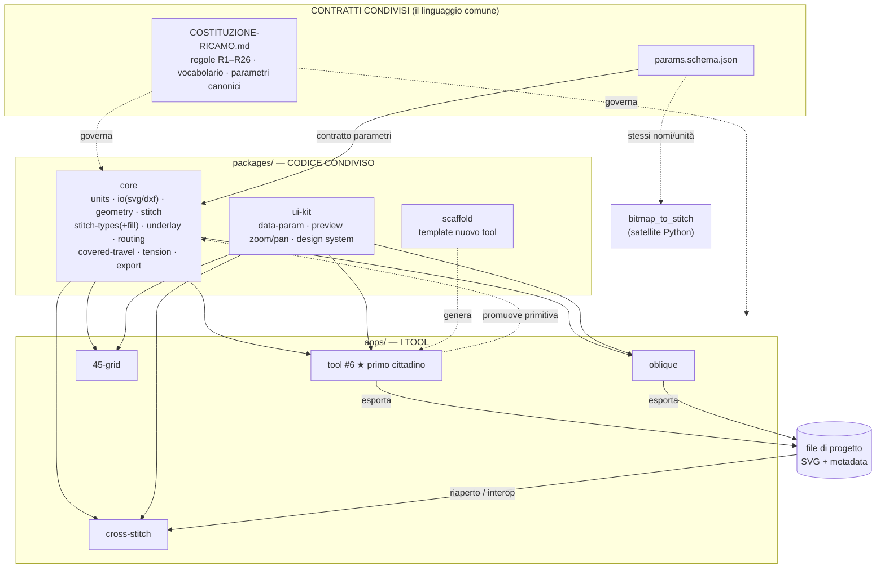

# Architettura dell'ecosistema ricamo

> Come i tool smettono di essere isole e diventano un ecosistema.
> Compagno della [Costituzione](COSTITUZIONE-RICAMO.md).

**Versione:** 0.1 · **Aggiornato:** 2026-07-14

---

## Il principio in una frase

Un **monorepo** con un **pacchetto `core` condiviso** a cui tutti i tool si agganciano via *workspace link*.
Migliorare il core migliora tutti; aggiungere a un tool si promuove nel core; i tool parlano lo stesso
linguaggio (mm, stessi tipi, stessi parametri) e **interoperano** via lo stesso formato di progetto.

## Le tre garanzie (e il meccanismo che le produce)

| Desiderio | Meccanismo |
|---|---|
| "miglioro una base → cambia per tutti" | tutti importano **lo stesso pacchetto `core`** (no copia-incolla): correggi una volta, vale per tutti |
| "aggiungo a uno → integro in tutti" | **percorso di promozione** app → core: una primitiva nasce in un tool, si prova, si promuove |
| "stesso ambiente, comunicano nelle basi" | **modello dati + parametri + formato progetto condivisi**: l'output di un tool è input di un altro |

## Schema



### In ASCII (fallback)

```
        CONTRATTI            COSTITUZIONE  +  params.schema.json
                                   │ governa / definisce
                                   ▼
        PACKAGES        ┌───────────────────────────────┐
                        │  core   ui-kit   scaffold      │
                        └───────────────┬───────────────┘
                                        │ import (workspace link)
                                        ▼
        APPS            oblique   45-grid   cross-stitch   tool#6★
                          │                                  │
                          └──────────► SVG+metadata ◄────────┘
                                   (interop: output = input)

        SATELLITE       bitmap_to_stitch (Python) ── segue params.schema.json + Costituzione
```

## Come si legge

- **Contratti** (in alto): non è codice eseguibile, è il *linguaggio*. La Costituzione governa tutto; `params.schema.json` è il ponte che fa parlare anche il satellite Python.
- **Packages**: il codice condiviso. `core` è la base che propaga. `ui-kit` e `scaffold` accelerano i nuovi tool ma non sono obbligatori dal giorno 1.
- **Apps**: i tool. Ognuno importa `core`; nessuno duplica. Il tool #6 nasce qui.
- **Freccia di promozione** (tool → core): il percorso per cui una buona idea in un tool diventa patrimonio di tutti.
- **File di progetto** (SVG + metadata, R9): il punto di interoperabilità. L'output di un tool si riapre in un altro.

## Regole di crescita

1. Il `core` **cresce per estrazione**, non per anticipazione: una primitiva entra nel core quando **un secondo tool** la richiede (o quando è ovviamente fondamentale: geometry, io, export).
2. Un tool **non modifica il core per un bisogno solo suo**: prima lo tiene in locale nell'app, poi — se si dimostra generale — lo promuove.
3. Ogni cosa nel core **rispetta la Costituzione** (nomi canonici §3, regole R1–R26).
4. I tool esistenti **migrano uno alla volta**, quando li tocchi. Nessun big-bang.
5. Il satellite Python **non entra nel workspace-link**: condivide contratti (`params.schema.json`), non codice.

## Stato di migrazione

| Tool | Stack | Stato |
|---|---|---|
| tool #6 | TS | ★ nasce nell'ecosistema |
| cross-stitch | TS+React | candidato facile (già TS/modulare) |
| oblique | vanilla JS | migra quando lo tocchi (consuma bundle ESM del core) |
| 45-grid | vanilla JS | migra quando lo tocchi |
| pattern-grammar-engine | TS/node | contribuisce infrastruttura (boundary/import, exporter) al core |
| bitmap_to_stitch | Python | satellite: contratti sì, codice no |

---

## Suite RG Tools — LIVE (v0.1)

Il monorepo è ora la **suite RG Tools** con una home comune e il design system integrato.

```
RG Tools (monorepo)
├─ packages/design-system   ★ RG Design System — SUBMODULE git (fonte di verità del look)
├─ packages/ui              integra il DS (rg.css) + chrome condiviso (topbar, registro tool)
├─ packages/core            @rg/core — geometria/IO/rete
├─ apps/shell               ★ HOME della suite: griglia di card, scegli il tool (hash routing)
└─ apps/net-45              tool "Rete 45°" — montabile (mountNet45) + standalone
```

**Come funziona:** `apps/shell` è l'unica app d'ingresso. Home (`#/`) = griglia di tool DS-styled;
clic su un tool → `#/net-45` → `mountNet45(root, {backHref:'#/'})` monta il tool dentro la shell
(link "← RG Tools" per tornare). Ogni tool esporta un `mount(root)` → è sia standalone sia integrato.

**Design system:** submodule in `packages/design-system`; `packages/ui/src/rg.css` importa i 6 file DS
nell'ordine richiesto. Ogni app importa `@rg/ui/rg.css` + usa le classi `.rg-*` e i token
(`var(--rg-color-*)`, `var(--rg-space-*)`). Nero/bianco, bordi sottili, niente hex inline.
Nota: i font AGNext/GT America non sono inclusi (regola DS) → fallback di sistema finché non si aggiungono.

**Avvio:** doppio-click su `avvia.bat` (root) → apre la home RG Tools. Aggiornare il DS: `git submodule update --remote`.

**Migrazione tool:** uno alla volta. Per portare oblique/45-grid/cross-stitch nella suite:
(1) esportare un `mount(root)`, (2) importare `@rg/ui/rg.css` e ri-vestire con le classi `.rg-*`,
(3) aggiungere una card in `packages/ui/src/tools.ts` e una route nella shell. Il satellite Python resta fuori.

> **Nota submodule locale:** il submodule punta a `../RG-DESIGN-SYSTEM` (path locale, entrambi i repo senza remote).
> Quando i repo andranno su GitHub, aggiornare l'URL del submodule in `.gitmodules` con quello remoto.
