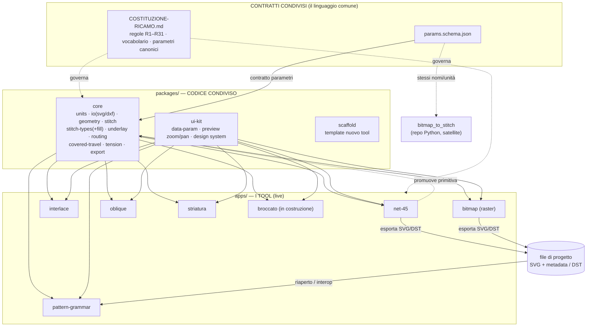

# Architettura dell'ecosistema ricamo

> Come i tool smettono di essere isole e diventano un ecosistema.
> Compagno della [Costituzione](COSTITUZIONE-RICAMO.md).

**Versione:** 0.4 · **Aggiornato:** 2026-08-26 · 6 tool live + 1 in costruzione

---

## Il principio in una frase

Un **monorepo** con un **pacchetto `core` condiviso** a cui tutti i tool si agganciano via *workspace link*.
Migliorare il core migliora tutti; aggiungere a un tool si promuove nel core; i tool parlano lo stesso
linguaggio (mm, stessi tipi, stessi parametri) e **interoperano** via lo stesso formato di progetto.

## Le tre garanzie (e il meccanismo che le produce)

| Desiderio | Meccanismo |
|---|---|
| "miglioro una base → cambia per tutti" | tutti importano **lo stesso pacchetto `core`** (no copia-incolla): correggi una volta, vale per tutti |
| "aggiungo a uno → integro in tutti" | **percorso di promozione** app → core: una primitiva nasce in un tool, si prova, si promuove |
| "stesso ambiente, comunicano nelle basi" | **modello dati + parametri + formato progetto condivisi**: l'output di un tool è input di un altro |

## Schema



### In ASCII (fallback)

```
        CONTRATTI            COSTITUZIONE  +  params.schema.json
                                   │ governa / definisce
                                   ▼
        PACKAGES        ┌───────────────────────────────┐
                        │  core   ui-kit   scaffold      │
                        └───────────────┬───────────────┘
                                        │ import (workspace link)
                                        ▼
        APPS      net-45  pattern-grammar  interlace  bitmap  oblique  striatura  broccato
                          │                                  │
                          └──────► SVG+metadata / DST ◄───────┘
                                   (interop: output = input)

        SATELLITE       bitmap_to_stitch (Python) ── segue params.schema.json + Costituzione
```

## Come si legge

- **Contratti** (in alto): non è codice eseguibile, è il *linguaggio*. La Costituzione governa tutto; `params.schema.json` è il ponte che fa parlare anche il satellite Python.
- **Packages**: il codice condiviso. `core` è la base che propaga. `ui-kit` e `scaffold` accelerano i nuovi tool ma non sono obbligatori dal giorno 1.
- **Apps**: i tool (net-45, pattern-grammar, interlace, bitmap, oblique). Ognuno importa `core`; nessuno duplica.
- **Freccia di promozione** (tool → core): il percorso per cui una buona idea in un tool diventa patrimonio di tutti.
- **File di progetto** (SVG + metadata, R9): il punto di interoperabilità. L'output di un tool si riapre in un altro.

## Regole di crescita

1. Il `core` **cresce per estrazione**, non per anticipazione: una primitiva entra nel core quando **un secondo tool** la richiede (o quando è ovviamente fondamentale: geometry, io, export).
2. Un tool **non modifica il core per un bisogno solo suo**: prima lo tiene in locale nell'app, poi — se si dimostra generale — lo promuove.
3. Ogni cosa nel core **rispetta la Costituzione** (nomi canonici §3, regole R1–R31).
4. I tool esistenti **migrano uno alla volta**, quando li tocchi. Nessun big-bang.
5. Il satellite Python **non entra nel workspace-link**: condivide contratti (`params.schema.json`), non codice.
6. **Un tool migrato arriva col suo motore: la regola 1 da sola non basta.** L'estrazione scatta quando un *secondo tool ha bisogno* di una primitiva — ma un tool che arriva già completo non "ha bisogno" di niente, e si porta dietro la sua risposta a domande già risolte nel core. Quindi: **a ogni migrazione si confrontano le primitive** (chiusura, colori, unità, tolleranze) e le divergenze si risolvono *esplicitamente*, prima di considerare finita la migrazione.
7. **Una divergenza numerica è una decisione, non un dettaglio.** Se due implementazioni rispondono diverso alla stessa domanda geometrica, la risposta giusta si decide col ricamo in mano, si scrive in Costituzione con la sua motivazione, e si blocca con un test in `test/smoke.mjs`. Mai risolverla scegliendo "quella che sembra ragionevole".

8. **Il test non serve a difendere il codice che funziona: serve a scoprire quello che non funziona.** Ogni motore, prima di essere considerato a posto, va misurato contro le regole che dice di rispettare — e la misura va scritta in `test/smoke.mjs`, non solo guardata una volta.

> **Da dove viene la 6 e la 7.** Migrando `pattern-grammar` sono entrate nel repo due implementazioni della domanda *"questo contorno è chiuso?"*: tolleranza **1.0 mm** nel core, **0.001** nel motore migrato. Mille volte diverse, entrambe funzionanti sui rispettivi file, nessuna delle due sbagliata di per sé — e nessun modo di accorgersene finché un file storto non fosse finito nel tool sbagliato. Risolta in R28.

> **Da dove viene la 8.** Scrivendo le invarianti dei motori che *non* avevano test sono usciti **cinque difetti veri**, nessuno dei quali si era mai manifestato come "qualcosa si è rotto": i passaggi di net-45 attraversavano le aree vuote (R5) fino a 16.5mm dentro; striatura non applicava il punto minimo (R3) e cuciva punti nello stesso buco; `insetPolygon` rientrava di 7.07mm quando gliene chiedevi 10; il "punto massimo" di pattern-grammar lasciava passare segmenti quasi doppi (R4); e l'importer a stringhe esplodeva sul file vero da 2MB. Tutti trovati **misurando**, non aspettando che qualcosa si rompesse — e ognuno era una regola della Costituzione già scritta e non verificata da nessuno.

## Stato di migrazione

| Tool | Stato |
|---|---|
| **net-45** (Rete 45°) | ✅ **live** — primo cittadino, rete di cordoncini a 45° |
| **pattern-grammar** (Generatore pattern) | ✅ **live** — motore migrato da `pattern-grammar-engine` |
| **interlace** (Interlace) | ✅ **live** — motore locale all'app, multicolore a stop |
| **bitmap** (Bitmap → Stitch) | ✅ **live** — calcolo punti migrato da `bitmap_to_stitch` (input raster, unico nella suite) |
| **oblique** (Broderie Anglaise) | ✅ **live** — porting da `rg-oblique-embroidery-pattern-generator` (usa le void, R5) |
| **striatura** (Punto Striato) | ✅ **live** — motore nuovo, nato dal DST di riferimento `PUNTO-STRIATURA.dst` |
| **broccato** (Broccato) | 🚧 **in costruzione** — da immagine a raso rado orizzontale con i passaggi nascosti; nato dalla decodifica di `BROCCATO.dst` |
| 45-grid, cross-stitch | da migrare quando li tocchi (stesso schema) |
| `bitmap_to_stitch` (repo Python) | satellite: contratti sì, codice no. Migrata la sola pipeline *immagine→punti→SVG*; il laboratorio DST/recipe con AI (CLIP/OpenAI) resta fuori scope |

**Capacità globali attive** (una volta, per tutti — vedi Costituzione): export **SVG e DST riapribili** (R9/R27/R31 — `readProjectMetadata` per l'SVG, `readDstMetadata` per il footer del DST; la cucitura resta byte-identica), export **DST macchina** (R31, `dstFromExportLayers`), **salvataggio con finestra di sistema** (R29), **pannello canonico** Testa A/B + accordion (DS v1.7.0), **passaggi che girano attorno alle aree vuote** (R5, `avoidVoids` in `travel.ts`), **cattura colore da immagine** (`quantize.ts`: median-cut deterministico, colore più vicino — estratta quando l’ha chiesta il terzo tool), **guida in-app** generata da `MANUALE.md` (bottone *Guida* nella topbar di ogni tool).

**Rete di sicurezza comune:** `npm test` (225 asserzioni: le primitive del core più le invarianti di tutti e sei i motori, su fixture sintetiche **e sugli SVG veri**), `npm run typecheck` (la build non controlla i tipi: vite usa esbuild) e `npm run build`. Tutti e tre girano in CI a ogni push.

---

## Suite RG Tools — LIVE (v0.1)

Il monorepo è ora la **suite RG Tools** con una home comune e il design system integrato.

```
RG Tools (monorepo)
├─ packages/design-system   ★ RG Design System — SUBMODULE git (tag v1.6.0)
├─ packages/ui              integra il DS + chrome condiviso (topbar, registro tool, pan/zoom, salvataggio file)
├─ packages/core            @rg/core — geometria/IO/mm/punti/export SVG + adattatore DST (R31) + readProjectMetadata
├─ packages/pattern-grammar @rg/pattern-grammar — motore del Generatore pattern
├─ apps/shell               ★ HOME della suite: griglia di card, scegli il tool (hash routing)
├─ apps/net-45              "Rete 45°"
├─ apps/pattern-grammar     "Generatore pattern"
├─ apps/interlace           "Interlace"
├─ apps/bitmap              "Bitmap → Stitch"  (input raster)
├─ apps/oblique             "Broderie Anglaise"
└─ apps/striatura           "Punto Striato"
```

**Come funziona:** `apps/shell` è l'unica app d'ingresso. Home (`#/`) = griglia di tool DS-styled;
clic su un tool → `#/<tool>` → `mount<Tool>(root, {backHref:'#/'})` monta il tool dentro la shell
(link "← RG Tools" per tornare). Ogni tool esporta un `mount(root)` → è sia standalone sia integrato.

**Design system:** submodule in `packages/design-system`; `packages/ui/src/rg.css` importa i 6 file DS
nell'ordine richiesto. Ogni app importa `@rg/ui/rg.css` + usa le classi `.rg-*` e i token
(`var(--rg-color-*)`, `var(--rg-space-*)`). Nero/bianco, bordi sottili, niente hex inline.
Nota: i font AGNext/GT America non sono inclusi (regola DS) → fallback di sistema finché non si aggiungono.

**Avvio:** doppio-click su `avvia.bat` (root) → apre la home RG Tools. Aggiornare il DS: `git submodule update --remote`.

**Migrazione tool:** uno alla volta. Per portare oblique/45-grid/cross-stitch nella suite:
(1) esportare un `mount(root)`, (2) importare `@rg/ui/rg.css` e ri-vestire con le classi `.rg-*`,
(3) aggiungere una card in `packages/ui/src/tools.ts` e una route nella shell. Il satellite Python resta fuori.

> **Submodule e pubblicazione:** il submodule punta al repo GitHub del DS, **pinnato al tag `v1.6.0`** (merge/tag del DS li fa Lorenzo, mai da una chat consumer). Il monorepo è su **GitHub** (`LorenzoErcoli/RG-EMBROIDERY-TOOLS-SUITE`) e si pubblica su **GitHub Pages** via Action (`.github/workflows/deploy.yml`) a ogni push: la suite è 100% lato browser → sito statico.
